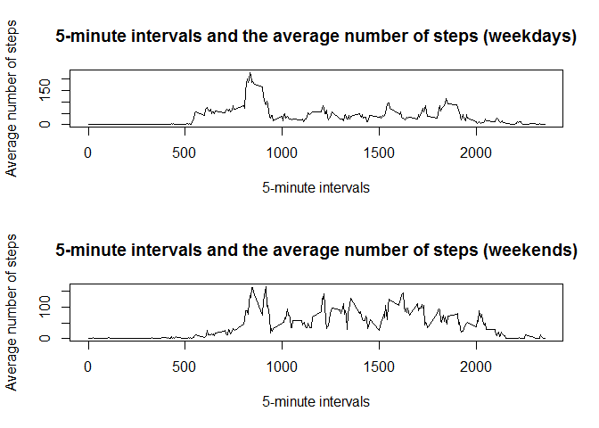

# Reproducible Research: Peer Assessment 1


## Loading and preprocessing the data


```r
if(!file.exists("activity.csv")){
    unzip("activity.zip")
}
data <- read.csv("activity.csv")
```

## What is mean total number of steps taken per day?

1. Calculate the total number of steps taken per day

```r
total_steps_per_day <- aggregate(data$steps, by = list(date = data$date), sum)
names(total_steps_per_day) <- c("date","totalsteps")
```

2. Make a histogram of the total number of steps taken each day


```r
hist(total_steps_per_day$totalsteps, 
     xlab="Total number of steps", 
     main="Histogram of the total number of steps taken each day")
```

 

3. Calculate and report the mean of the total number of steps taken per day


```r
mean(total_steps_per_day$totalsteps, na.rm=T)
```

```
## [1] 10766.19
```

4. Calculate and report the median of the total number of steps taken per day


```r
median(total_steps_per_day$totalsteps, na.rm=T)
```

```
## [1] 10765
```

## What is the average daily activity pattern?

1. Make a time series plot (i.e. type = "1") of the 5-minute interval (x-axis) and the average number of steps taken, averaged across all days (y-axis)


```r
average_steps_per_interval <- aggregate(data$steps, by = list(interval = data$interval), mean, na.rm=T)
names(average_steps_per_interval) <- c("interval","averagesteps")
plot(average_steps_per_interval$interval,
     average_steps_per_interval$averagesteps,
     type = "l",
     main="5-minute intervals and the average number of steps", 
     xlab="5-minute intervals", 
     ylab="Average number of steps")
```

 

2. Which 5-minute interval, on average across all the days in the dataset, contains the maximum number of steps?


```r
average_steps_per_interval[which.max(average_steps_per_interval$averagesteps),]
```

```
##     interval averagesteps
## 104      835     206.1698
```

## Imputing missing values

1. Calculate and report the total number of missing values in the dataset (i.e. the total number of rows with NAs)


```r
sum(is.na(data))
```

```
## [1] 2304
```

2. Devise a strategy for filling in all of the missing values in the dataset. The strategy does not need to be sophisticated. For example, you could use the mean/median for that day, or the mean for that 5-minute interval, etc. Create a new dataset that is equal to the original dataset but with the missing data filled in.


```r
ndata <- data.frame(data)
for(i in which(is.na(ndata))){
    ndata[i,]$steps <- average_steps_per_interval[average_steps_per_interval$interval == ndata[i,]$interval,]$averagesteps
}
sum(is.na(ndata))
```

```
## [1] 0
```

3. Calculate the total number of steps taken per day

```r
ntotal_steps_per_day <- aggregate(ndata$steps, by = list(date = ndata$date), sum)
names(ntotal_steps_per_day) <- c("date","totalsteps")
```

4. Make a histogram of the total number of steps taken each day


```r
hist(ntotal_steps_per_day$totalsteps, 
     xlab="Total number of steps", 
     main="Histogram of the total number of steps taken each day")
```

 

5. Calculate and report the mean of the total number of steps taken per day


```r
mean(ntotal_steps_per_day$totalsteps)
```

```
## [1] 10766.19
```

6. Calculate and report the median of the total number of steps taken per day


```r
median(ntotal_steps_per_day$totalsteps)
```

```
## [1] 10766.19
```

5. Do these values differ from the estimates from the first part of the assignment? 

* Mean


```r
abs(mean(ntotal_steps_per_day$totalsteps) - mean(total_steps_per_day$totalsteps, na.rm=T))
```

```
## [1] 0
```

* Median


```r
abs(median(ntotal_steps_per_day$totalsteps) - median(total_steps_per_day$totalsteps, na.rm=T))
```

```
## [1] 1.188679
```

6. What is the impact of imputing missing data on the estimates of the total daily number of steps?

* Details of the differences between two datasets


```r
suppressMessages(require(dplyr))
anti_join(ntotal_steps_per_day,total_steps_per_day)
```

```
## Joining by: c("date", "totalsteps")
```

```
##         date totalsteps
## 1 2012-11-09   10766.19
## 2 2012-10-08   10766.19
## 3 2012-11-10   10766.19
## 4 2012-11-30   10766.19
## 5 2012-11-14   10766.19
## 6 2012-11-01   10766.19
## 7 2012-10-01   10766.19
## 8 2012-11-04   10766.19
```

* Visual representation of the impact - histogram comparison


```r
hist(ntotal_steps_per_day$totalsteps, 
     xlab="Total number of steps", 
     main="Histogram of the total number of steps taken each day", 
     col="blue")
hist(total_steps_per_day$totalsteps,
     add=T,
     col="red")
legend("topright", c("Imputed", "Original"), col=c("blue", "red"), lwd=10)
```

 

## Are there differences in activity patterns between weekdays and weekends?

1. Create a new factor variable in the dataset with two levels – “weekday” and “weekend” indicating whether a given date is a weekday or weekend day.


```r
suppressMessages(require(chron))
ndata$rdate <- as.Date(ndata$date, "%Y-%m-%d")
ndata$wpart <- ifelse(is.weekend(ndata$rdate),"weekend","weekday")
ndata$wpart <- factor(ndata$wpart)
```

2. Make a panel plot containing a time series plot (i.e. type = "l") of the 5-minute interval (x-axis) and the average number of steps taken, averaged across all weekday days or weekend days (y-axis). See the README file in the GitHub repository to see an example of what this plot should look like using simulated data.


```r
sdata <- split(ndata, ndata$wpart)

average_steps_per_interval_weekday <- aggregate(sdata[[1]]$steps, by = list(interval = sdata[[1]]$interval), mean)
names(average_steps_per_interval_weekday) <- c("interval","averagesteps")

average_steps_per_interval_weekend <- aggregate(sdata[[2]]$steps, by = list(interval = sdata[[2]]$interval), mean)
names(average_steps_per_interval_weekend) <- c("interval","averagesteps")

par(mfrow = c(2,1))

plot(average_steps_per_interval_weekday$interval,
     average_steps_per_interval_weekday$averagesteps,
     type = "l",
     main="5-minute intervals and the average number of steps (weekdays)", 
     xlab="5-minute intervals", 
     ylab="Average number of steps")

plot(average_steps_per_interval_weekend$interval,
     average_steps_per_interval_weekend$averagesteps,
     type = "l",
     main="5-minute intervals and the average number of steps (weekends)", 
     xlab="5-minute intervals", 
     ylab="Average number of steps")
```

 
